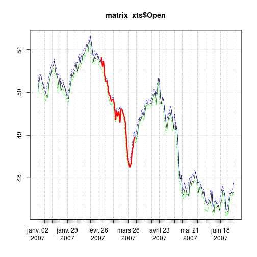

XTS
========================================================

Etude du package __xts__. _xts_ pour _extended time series_ permet de travailler avec pratiquement tous les packages analysant les séries temporelles et notamment __zoo__ dont il dérive.

On peut facilemnt créér un objet _xts_ à partir d'un objet existant. Deux informations sont nécessaires:
- un objet de type _matrix_, _dataframe_, _ts_, _zoo_, _irts_, _its_ ou _time_series_, comportant une colonne de type Date ou DateTime
- un _index_ précisant le type d'objet date qui servira de référence. _as.xts_ détermine alors automatiquement la colonne qui servira d'index. Si on ne précise pas cette information, _xts_ utilise par défaut le type _POSIXct_. Les type temporels acceptés sont _Date_, _POSIXct_, _chron_ package chron), _yearmon_ (package zoo), _yearqrt_ (package zoo), _timeDate_ (package timeDate).


```r
library("xts", lib.loc="/home/jcb/R/x86_64-pc-linux-gnu-library/3.1")
```

```
## Loading required package: zoo
## 
## Attaching package: 'zoo'
## 
## Les objets suivants sont masqués from 'package:base':
## 
##     as.Date, as.Date.numeric
```

```r
data(sample_matrix) # matrice de démo
head(sample_matrix) # première col = Date
```

```
##             Open  High   Low Close
## 2007-01-02 50.04 50.12 49.95 50.12
## 2007-01-03 50.23 50.42 50.23 50.40
## 2007-01-04 50.42 50.42 50.26 50.33
## 2007-01-05 50.37 50.37 50.22 50.33
## 2007-01-06 50.24 50.24 50.11 50.18
## 2007-01-07 50.13 50.22 49.99 49.99
```

```r
matrix_xts <- as.xts(sample_matrix, dateFormat="Date") # on en fait un objet Xts
# on précise simplement le type d'objet temporel qui servira d'index. Xts trouve
# automatiquement la bonne colonne
head(matrix_xts)
```

```
##             Open  High   Low Close
## 2007-01-02 50.04 50.12 49.95 50.12
## 2007-01-03 50.23 50.42 50.23 50.40
## 2007-01-04 50.42 50.42 50.26 50.33
## 2007-01-05 50.37 50.37 50.22 50.33
## 2007-01-06 50.24 50.24 50.11 50.18
## 2007-01-07 50.13 50.22 49.99 49.99
```

```r
str(matrix_xts)
```

```
## An 'xts' object on 2007-01-02/2007-06-30 containing:
##   Data: num [1:180, 1:4] 50 50.2 50.4 50.4 50.2 ...
##  - attr(*, "dimnames")=List of 2
##   ..$ : NULL
##   ..$ : chr [1:4] "Open" "High" "Low" "Close"
##   Indexed by objects of class: [Date] TZ: UTC
##   xts Attributes:  
##  NULL
```

```r
plot(matrix_xts$Open) # plot n'accepte que des données univariées => il faut
# préciser le vecteur à tracer
lines(matrix_xts$High, col="blue", lty=2) # on complète avec line
lines(matrix_xts$Low, col="green", lty=2)
# la méthode subsetting de vts permet de sélectionner une partie du tracé, ici 
# le mois de mars, our en changer la couleur
lines(matrix_xts$Open["2007-03"], col="red", lw=3)
```

 

On peut également créer directement un objet _xts_ à partir de la fonction __xts()__:


```r
xts(1:10, Sys.Date()+1:10)
```

```
##            [,1]
## 2014-06-15    1
## 2014-06-16    2
## 2014-06-17    3
## 2014-06-18    4
## 2014-06-19    5
## 2014-06-20    6
## 2014-06-21    7
## 2014-06-22    8
## 2014-06-23    9
## 2014-06-24   10
```


