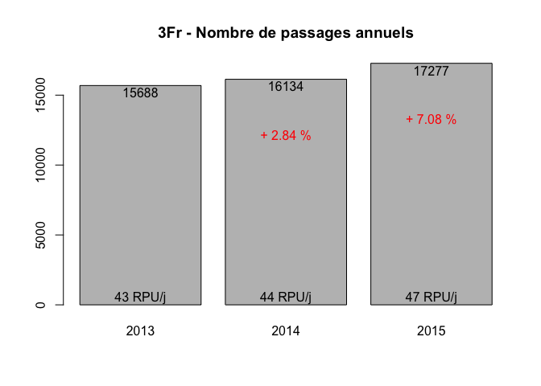

# Nombre de RPU par années
JcB  
25 avril 2016  


Pour chaque année on calcule le nombre de RPU par FINESS. Le résultat est un vecteur qui est stocké dans le répertoire __DATA/YEAR/__ et dans le ficher __RPU_YYYY_ans.Rda__. Il y a un fichier par année.

```
y2013 <- tapply(as.Date(d13$ENTREE), list(year(as.Date(d13$ENTREE)), d13$FINESS), length)
y2014 <- tapply(as.Date(d14$ENTREE), list(year(as.Date(d14$ENTREE)), d14$FINESS), length)
y2015 <- tapply(as.Date(d15$ENTREE), list(year(as.Date(d15$ENTREE)), d15$FINESS), length)

save(y2013, file = "../DATA/YEAR/RPU_2013_ans.Rda")
save(y2014, file = "../DATA/YEAR/RPU_2014_ans.Rda")
save(y2015, file = "../DATA/YEAR/RPU_2015_ans.Rda")
```
Le nombre de FINESS est variable d'une anné à l'autre ce qui ne permet pas de les fusionner.

Exemple de présentation avec 3Fr
=================================

Chaque année est représentée par un barplot surlequel on ajoute:

- le nomnre de RPU de l'année
- le % de variation d'une année sur l'autre
- le nombre moyen de passages par jour

Récupération des données
------------------------

```r
finess <- "3Fr"

# lit les dataframes n de RPU par mois et par Finess déjà archivés
load("../../../../DATA/YEAR/RPU_2013_ans.Rda") # y2013
load("../../../../DATA/YEAR/RPU_2014_ans.Rda") # y2014
load("../../../../DATA/YEAR/RPU_2015_ans.Rda") # y2015

# récupération des 3 années dans le vecteur c
c <- c(y2013[1, finess], y2014[1, finess], y2015[1, finess])
```

Nombre moyen de passages par jour
---------------------------------

Il faut calculer le nombre de jours de l'année. Par ex. pour 2013:


```r
as.Date("2014-01-01") - as.Date("2013-01-01")
```

```
## Time difference of 365 days
```

Pour 2016:

```r
as.Date("2017-01-01") - as.Date("2016-01-01")
```

```
## Time difference of 366 days
```

On crée un vecteur du nb de jours dans 'année à partir 2013

```r
an <- c(365, 365, 365) # 366 pour 2016
```

Moyenne par jour

```r
r <- round(c/an)
r
```

```
## [1] 43 44 47
```

Graphique
----------


```r
# Barplot. Le vecteur b récupère les abcisse des barres.
b <- barplot(c, main = paste(finess, "- Nombre de passages annuels"), names.arg = c(2013, 2014, 2015))

# on place le nombre de RPU de l'année au sommet de la barre
text(b, c - 500, labels = c)

# calcul de lea variation annuelle en %
p <- round(100 * (c[2] - c[1])/c[1], 2)
# si la variation est positive, on la fait précéder du signe "+". On complète par le suffixe "%"
p2 <- ifelse(p > 0, paste("+",p,"%"), paste(p,"%"))

# idem pour la 3eme année
p <- round(100 * (c[3] - c[2])/c[2], 2)
p3 <- ifelse(p > 0, paste("+",p,"%"), paste(p,"%"))

# on forme un vecteur des symboles
pp <- c("", p2, p3)

# et on l'affiche
text(b, c-4000, pp, col = "red")

# ajout du nombre moyen de passages
text(b, 500, paste(r, "RPU/j"))
```




