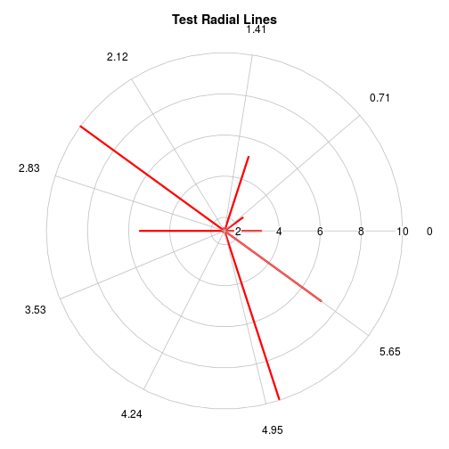
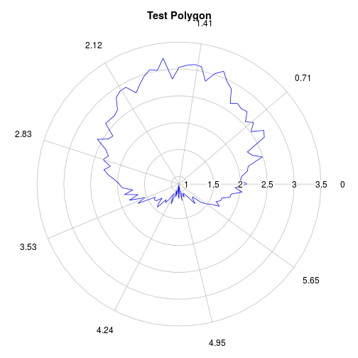
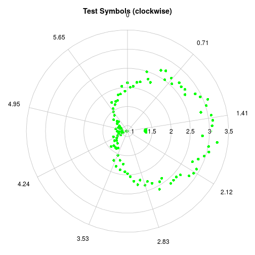
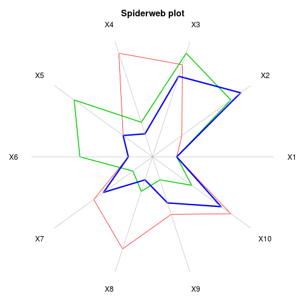
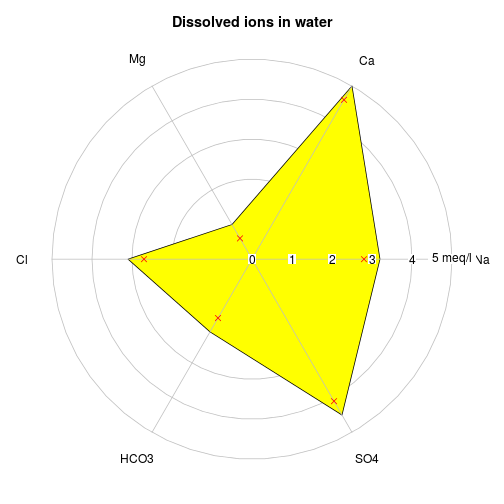
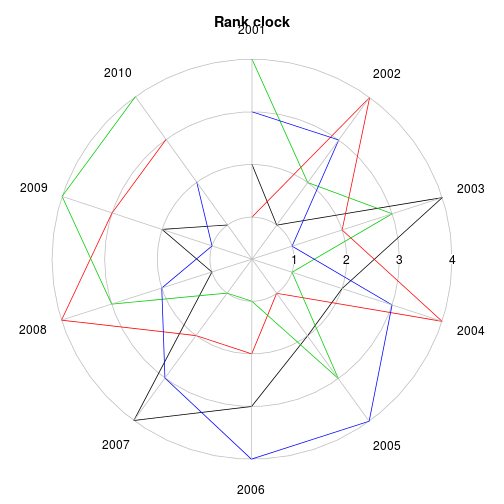

radial.plot {plotrix}  R Documentation
========================================================

Plot values on a circular grid of 0 to 2*pi radians

Description
-----------

Plot numeric values as distances from the center of a circular field in the directions defined by angles in radians.

Usage
-----
```
 radial.plot(
  lengths,
  radial.pos=NULL,
  labels,label.pos=NULL,
  radlab=FALSE,
 start=0,
 clockwise=FALSE,
 rp.type="r",
 label.prop=1.15,main="",
 xlab="",ylab="",
 line.col=par("fg"),
 lty=par("lty"),
 lwd=par("lwd"),
 mar=c(2,2,3,2),
 show.grid=TRUE,
 show.grid.labels=4,
 show.radial.grid=TRUE,
 grid.col="gray",
 grid.bg="transparent",
 grid.left=FALSE,
 grid.unit=NULL,
 point.symbols=NULL,
 point.col=NULL,
 show.centroid=FALSE,
 radial.lim=NULL,
 radial.labels=NULL,
 boxed.radial=TRUE,
 poly.col=NULL,
 add=FALSE,
 ...)
 ```

Arguments
---------

lengths  
A numeric data vector or matrix. If lengths is a matrix, the rows will be considered separate data vectors.

radial.pos	
A numeric vector or matrix of positions in radians. These are interpreted as beginning at the right (0 radians) and moving counterclockwise. If radial.pos is a matrix, the rows must correspond to rows of lengths.

labels	
Character strings to be placed at the outer ends of the lines. If set to NA, will suppress printing of labels, but if missing, the radial positions will be used.

label.pos	
The positions of the labels around the plot in radians.

radlab	
Whether to rotate the outer labels to a radial orientation.

start	
Where to place the starting (zero) point. Defaults to the 3 o'clock position.

clockwise	
Whether to interpret positive positions as clockwise from the starting point. The default is counterclockwise.

rp.type	
Whether to draw (r)adial lines, a (p)olygon, (s)ymbols or some combination of these. If lengths is a matrix and rp.type is a vector, each row of lengths can be displayed differently.

label.prop	
The label position radius as a proportion of the maximum line length.

main	
The title for the plot.

xlab,ylab	
Normally x and y axis labels are suppressed.

line.col	
The color of the radial lines or polygons drawn.

lty	
The line type(s) to be used for polygons or radial lines.

lwd	
The line width(s) to be used for polygons or radial lines.

mar	
Margins for the plot. Allows the user to leave space for legends, long labels, etc.

show.grid	
Logical - whether to draw a circular grid.

show.grid.labels	
Whether and where to display labels for the grid - see Details.

show.radial.grid	
Whether to draw radial lines to the plot labels.

grid.col	
Color of the circular grid.

grid.bg	
Fill color of above.

grid.left	
Whether to place the radial grid labels on the left side.

grid.unit	
Optional unit description for the grid.

point.symbols	
The symbols for plotting (as in pch).

point.col	
Colors for the symbols.

show.centroid	
Whether to display a centroid.

radial.lim	
The range of the grid circle. Defaults to pretty(range(lengths)), but if more than two values are passed, the exact values will be displayed.

radial.labels	
Optional labels for the radial grid. The default is the values of radial.lim.

boxed.radial	
Whether to use boxed.labels or text for radial labels.

poly.col	
Fill color if polygons are drawn. Use NA for no fill.

add	
Whether to add one or more series to an existing plot.

...	
Additional arguments are passed to plot.

Details

radial.plot displays a plot of radial lines, polygon(s), symbols or a combination of these centered at the midpoint of the plot frame, the lengths, vertices or positions corresponding to the numeric magnitudes of the data values. If show.centroid is TRUE, an enlarged point at the centroid of values is displayed. The centroid is calculated as the average of x and y values unless rp.type="p". In this case, the barycenter of the polygon is calculated. Make sure that these suit your purpose, otherwise calculate the centroid that you really want and add it with the points function. Note that if the observations are not taken at equal intervals around the circle, the centroid may not mean much.

If the user wants to plot several sets of lines, points or symbols by passing matrices or data frames of lengths and radial.pos, remember that these will be grouped by row, so transpose if the data are grouped by columns.

If more series are added to an existing plot, radial.plot will try to maintain the current plot parameters. Resetting the parameters after doing the initial plot will almost certainly mess up any series that are added. Series that are added will be plotted "on top" of the existing plot, possibly overplotting other things. If the added series have a larger range than the initial series, set radial.lim to account for this in the initial plot, and if radial.lim is specified in the initial plot, remember to repeat it for added series as in the example.

The size of the labels on the outside of the plot can be adjusted by setting par(cex.axis=) and that of the labels inside by setting par(cex.lab=). If radlab is TRUE, the labels will be rotated to a radial alignment. This may help when there are many values and labels. If some labels are still crowded, try running label.pos through the spreadout function. If the show.grid.labels argument is a number from 1 to 4, the labels will be placed along a horizontal or vertical radius. The numbers represent the same positions as in axis, with the default (4) on the right.

The radial.plot family of plots is useful for illustrating cyclic data such as wind direction or speed (but see oz.windrose for both), activity at different times of the day, and so on. While radial.plot actually does the plotting, another function is usually called for specific types of cyclic data.

Value

The par values that are changed in the function as they were at the time radial.plot was called.

Author(s)

Jim Lemon - thanks to Jeremy Claisse and Antonio Hernandez Matias for the lty and rp.type suggestions respectively, Patrick Baker for the request that led to radlab, Thomas Steiner for the request for the radial.lim and radial.labels modifications, Evan Daugharty for requesting the add argument, James MacCarthy for requesting better radial labels, Steve Ellison for noticing that the return values of the functions had changed and Don Dennerline for requesting the rank clock.

See Also

polar.plot,clock24.plot

Examples
--------


```r

library("plotrix")

testlen <- runif(10, 0, 10)
testpos <- seq(0, 18 * pi/10, length = 10)
testlab <- letters[1:10]
oldpar <- radial.plot(testlen, testpos, main = "Test Radial Lines", line.col = "red", 
    lwd = 3)
```

```
## Warning: 'x' is NULL so the result will be NULL
## Warning: 'x' is NULL so the result will be NULL
## Warning: 'x' is NULL so the result will be NULL
```

 

```r
testlen <- c(sin(seq(0, 1.98 * pi, length = 100)) + 2 + rnorm(100)/10)
testpos <- seq(0, 1.98 * pi, length = 100)
radial.plot(testlen, testpos, rp.type = "p", main = "Test Polygon", line.col = "blue")
```

```
## Warning: 'x' is NULL so the result will be NULL
## Warning: 'x' is NULL so the result will be NULL
## Warning: 'x' is NULL so the result will be NULL
```

 

```r
# now do a 12 o'clock start with clockwise positive
radial.plot(testlen, testpos, start = pi/2, clockwise = TRUE, rp.type = "s", 
    main = "Test Symbols (clockwise)", point.symbols = 16, point.col = "green", 
    show.centroid = TRUE)
```

```
## Warning: 'x' is NULL so the result will be NULL
```

 

```r
# one without the circular grid and multiple polygons see the 'diamondplot'
# function for variation on this
posmat <- matrix(sample(2:9, 30, TRUE), nrow = 3)
radial.plot(posmat, labels = paste("X", 1:10, sep = ""), rp.type = "p", main = "Spiderweb plot", 
    line.col = 2:4, show.grid = FALSE, lwd = 1:3, radial.lim = c(0, 10))
```

```
## Warning: 'x' is NULL so the result will be NULL
## Warning: 'x' is NULL so the result will be NULL
## Warning: 'x' is NULL so the result will be NULL
```

 

```r
# dissolved ions in water
ions <- c(3.2, 5, 1, 3.1, 2.1, 4.5)
ion.names <- c("Na", "Ca", "Mg", "Cl", "HCO3", "SO4")
radial.plot(ions, labels = ion.names, rp.type = "p", main = "Dissolved ions in water", 
    grid.unit = "meq/l", radial.lim = c(0, 5), poly.col = "yellow")
```

```
## Warning: 'x' is NULL so the result will be NULL
## Warning: 'x' is NULL so the result will be NULL
```

```r
# add points inside the polygon
radial.plot(ions - 0.4, rp.type = "s", radial.lim = c(0, 5), point.symbols = 4, 
    point.col = "red", add = TRUE)
```

```
## Warning: 'x' is NULL so the result will be NULL
```

 

```r
radmat <- matrix(c(sample(1:4, 4), sample(1:4, 4), sample(1:4, 4), sample(1:4, 
    4), sample(1:4, 4), sample(1:4, 4), sample(1:4, 4), sample(1:4, 4), sample(1:4, 
    4), sample(1:4, 4)), nrow = 4)
# finally a rank clock
radial.plot(radmat, rp.type = "l", radial.pos = seq(0, 20 * pi/11.1, length.out = 10), 
    label.pos = seq(0, 20 * pi/11.1, length.out = 10), start = pi/2, clockwise = TRUE, 
    labels = 2001:2010, radial.lim = c(0.2, 4), main = "Rank clock")
```

```
## Warning: 'x' is NULL so the result will be NULL
## Warning: 'x' is NULL so the result will be NULL
## Warning: 'x' is NULL so the result will be NULL
```

 

```r
par(xpd = oldpar$xpd, mar = oldpar$mar, pty = oldpar$pty)
# reset the margins
par(mar = c(5, 4, 4, 2))
```


Structure de la méthode
-----------------------
```
> radial.plot
function (lengths, radial.pos = NULL, labels = NA, label.pos = NULL, 
    radlab = FALSE, start = 0, clockwise = FALSE, rp.type = "r", 
    label.prop = 1.15, main = "", xlab = "", ylab = "", line.col = par("fg"), 
    lty = par("lty"), lwd = par("lwd"), mar = c(2, 2, 3, 2), 
    show.grid = TRUE, show.grid.labels = 4, show.radial.grid = TRUE, 
    grid.col = "gray", grid.bg = "transparent", grid.left = FALSE, 
    grid.unit = NULL, point.symbols = NULL, point.col = NULL, 
    show.centroid = FALSE, radial.lim = NULL, radial.labels = NULL, 
    boxed.radial = TRUE, poly.col = NULL, add = FALSE, ...) 
{
    if (is.null(radial.lim)) 
        radial.lim <- range(lengths)
    length.dim <- dim(lengths)
    if (is.null(length.dim)) {
        npoints <- length(lengths)
        nsets <- 1
        lengths <- matrix(lengths, nrow = 1)
    }
    else {
        npoints <- length.dim[2]
        nsets <- length.dim[1]
        lengths <- as.matrix(lengths)
    }
    lengths <- lengths - radial.lim[1]
    lengths[lengths < 0] <- NA
    if (is.null(radial.pos[1])) 
        radial.pos <- seq(0, pi * (2 - 2 * (rp.type != "l")/npoints), 
            length.out = npoints)
    radial.pos.dim <- dim(radial.pos)
    if (is.null(radial.pos.dim)) 
        radial.pos <- matrix(rep(radial.pos, nsets), nrow = nsets, 
            byrow = TRUE)
    else radial.pos <- as.matrix(radial.pos)
    if (rp.type == "l") {
        clockwise <- TRUE
        start <- pi/2
    }
    if (clockwise) 
        radial.pos <- -radial.pos
    if (start) 
        radial.pos <- radial.pos + start
    if (show.grid) {
        if (length(radial.lim) < 3) 
            grid.pos <- pretty(radial.lim)
        else grid.pos <- radial.lim
        if (grid.pos[1] < radial.lim[1]) 
            grid.pos <- grid.pos[-1]
        maxlength <- max(grid.pos - radial.lim[1])
        angles <- seq(0, 1.96 * pi, by = 0.04 * pi)
    }
    else {
        grid.pos <- NA
        maxlength <- diff(radial.lim)
    }
    oldpar <- par("xpd", "mar", "pty")
    if (!add) {
        par(mar = mar, pty = "s")
        plot(c(-maxlength, maxlength), c(-maxlength, maxlength), 
            type = "n", axes = FALSE, main = main, xlab = xlab, 
            ylab = ylab)
        if (show.grid) {
            for (i in seq(length(grid.pos), 1, by = -1)) {
                xpos <- cos(angles) * (grid.pos[i] - radial.lim[1])
                ypos <- sin(angles) * (grid.pos[i] - radial.lim[1])
                polygon(xpos, ypos, border = grid.col, col = grid.bg)
            }
        }
    }
    par(xpd = TRUE)
    if (length(line.col) < nsets) 
        line.col <- 1:nsets
    if (length(rp.type) < nsets) 
        rp.type <- rep(rp.type, length.out = nsets)
    if (length(point.symbols) < nsets) 
        point.symbols <- rep(point.symbols, length.out = nsets)
    if (length(point.col) < nsets) 
        point.col <- rep(point.col, length.out = nsets)
    if (length(poly.col) < nsets) 
        poly.col <- rep(poly.col, length.out = nsets)
    if (length(lty) < nsets) 
        lty <- rep(lty, length.out = nsets)
    if (length(lwd) < nsets) 
        lwd <- rep(lwd, length.out = nsets)
    for (i in 1:nsets) {
        if (nsets > 1) {
            linecol <- line.col[i]
            polycol <- poly.col[i]
            pointcol <- point.col[i]
            pointsymbols <- point.symbols[i]
            ltype <- lty[i]
            lwidth <- lwd[i]
        }
        else {
            linecol <- line.col
            polycol <- poly.col
            pointcol <- point.col
            pointsymbols <- point.symbols
            ltype <- lty
            lwidth <- lwd
        }
        rptype <- unlist(strsplit(rp.type[i], ""))
        if (match("s", rptype, 0)) {
            if (is.null(pointsymbols)) 
                pointsymbols <- i
            if (is.null(pointcol)) 
                pointcol <- i
        }
        xpos <- cos(radial.pos[i, ]) * lengths[i, ]
        ypos <- sin(radial.pos[i, ]) * lengths[i, ]
        if (match("r", rptype, 0)) 
            segments(0, 0, xpos, ypos, col = linecol, lty = ltype, 
                lwd = lwidth, ...)
        if (match("p", rptype, 0)) 
            polygon(xpos, ypos, border = linecol, col = polycol, 
                lty = ltype, lwd = lwidth, ...)
        if (match("s", rptype, 0)) 
            points(xpos, ypos, pch = pointsymbols, col = pointcol, 
                ...)
        if (match("l", rptype, 0)) 
            lines(xpos, ypos, lty = ltype, lwd = lwidth, col = linecol, 
                ...)
        if (show.centroid) 
            if (match("p", rptype, 0)) {
                nvertices <- length(xpos)
                polygonarea <- xpos[nvertices] * ypos[1] - xpos[1] * 
                  ypos[nvertices]
                for (vertex in 1:(nvertices - 1)) polygonarea <- polygonarea + 
                  xpos[vertex] * ypos[vertex + 1] - xpos[vertex + 
                  1] * ypos[vertex]
                polygonarea <- polygonarea/2
                centroidx <- (xpos[nvertices] + xpos[1]) * (xpos[nvertices] * 
                  ypos[1] - xpos[1] * ypos[nvertices])
                centroidy <- (ypos[nvertices] + ypos[1]) * (xpos[nvertices] * 
                  ypos[1] - xpos[1] * ypos[nvertices])
                for (vertex in 1:(nvertices - 1)) {
                  centroidx <- centroidx + (xpos[vertex] + xpos[vertex + 
                    1]) * (xpos[vertex] * ypos[vertex + 1] - 
                    xpos[vertex + 1] * ypos[vertex])
                  centroidy <- centroidy + (ypos[vertex] + ypos[vertex + 
                    1]) * (xpos[vertex] * ypos[vertex + 1] - 
                    xpos[vertex + 1] * ypos[vertex])
                }
                points(centroidx/(6 * polygonarea), centroidy/(6 * 
                  polygonarea), col = point.col[i], pch = point.symbols[i], 
                  cex = 2, ...)
            }
            else points(mean(xpos), mean(ypos), col = pointcol, 
                pch = pointsymbols, cex = 2, ...)
    }
    if (!add) {
        if (is.na(labels[1])) {
            label.pos <- seq(0, 1.8 * pi, length = 9)
            labels <- as.character(round(label.pos, 2))
        }
        if (is.null(label.pos[1])) {
            lablen <- length(labels)
            label.pos <- seq(0, pi * (2 - 2/lablen), length.out = lablen)
        }
        if (clockwise) 
            label.pos <- -label.pos
        if (start) 
            label.pos <- label.pos + start
        xpos <- cos(label.pos) * maxlength
        ypos <- sin(label.pos) * maxlength
        if (show.radial.grid) 
            segments(0, 0, xpos, ypos, col = grid.col)
        xpos <- cos(label.pos) * maxlength * label.prop
        ypos <- sin(label.pos) * maxlength * label.prop
        if (radlab) {
            for (label in 1:length(labels)) {
                labelsrt <- (180 * label.pos[label]/pi) + 180 * 
                  (label.pos[label] > pi/2 && label.pos[label] < 
                    3 * pi/2)
                text(xpos[label], ypos[label], labels[label], 
                  cex = par("cex.axis"), srt = labelsrt)
            }
        }
        else boxed.labels(xpos, ypos, labels, ypad = 0.7, border = FALSE, 
            cex = par("cex.axis"))
        if (show.grid.labels) {
            if (show.grid.labels%%2) {
                ypos <- grid.pos - radial.lim[1]
                xpos <- rep(0, length(grid.pos))
                if (show.grid.labels == 1) 
                  ypos <- -ypos
            }
            else {
                xpos <- grid.pos - radial.lim[1]
                ypos <- rep(0, length(grid.pos))
                if (show.grid.labels == 2) 
                  xpos <- -xpos
            }
            if (is.null(radial.labels)) 
                radial.labels = as.character(grid.pos)
            if (!is.null(grid.unit)) 
                radial.labels[length(grid.pos)] <- paste(radial.labels[length(grid.pos)], 
                  grid.unit)
            if (boxed.radial) 
                boxed.labels(xpos, ypos, radial.labels, border = FALSE, 
                  cex = par("cex.lab"))
            else text(xpos, ypos, radial.labels, cex = par("cex.lab"))
        }
    }
    invisible(oldpar)
}
<environment: namespace:plotrix>
```
